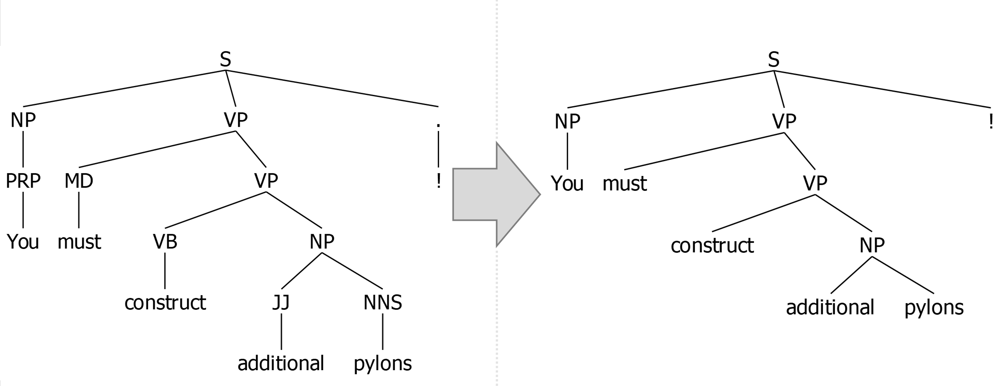

# Constituent Treelib (CTL)
A lightweight Python library for constructing, processing, and visualizing constituent trees.


# Description
CTL allows you to easily construct a <a href="https://en.wikipedia.org/wiki/Constituent_(linguistics)">constituent tree</a> representation of sentences, visualize them and export them into various [file formats](#Export_visualization). Moreover, you can conveniently extract phrases according to their phrasal categories, which can be used, for example, as features for various NLP tasks. 

CTL is built on top of <a href="https://github.com/nikitakit/self-attentive-parser">**benepar**</a> (*Berkeley Neural Parser*) as well as the two well-known NLP frameworks <a href="https://spacy.io">**spaCy**</a> and <a href="https://github.com/nltk/nltk">**NLTK**</a>. Here, spaCy is used for tokenization and sentence segmentation, while benepar performs the actual parsing of the sentences. NLTK, on the other hand, provides the fundamental data structure for storing and processing the parsed sentences. 

To gain a clearer picture of what a constituent tree looks like, consider the following example. Given the sentence *S = "Stanley Getz was an American jazz saxophonist."* CTL first parses *S* into a so-called *bracketed tree string* representation (shown below in a <a href="https://catalog.ldc.upenn.edu/LDC99T42">*Penn tree-bank*</a> style):   
```
(S
  (NP (NNP Stanley) (NNP Getz))
  (VP
    (VBD was)
    (NP (DT an) (JJ American) (NN jazz) (NN saxophonist)))
  (. .))
```

This string represents the actual constituent tree, which can then be visualized and exported to a desired format, here for instance as a <a href="https://github.com/Halvani/Constituent-Treelib/blob/main/assets/images/sample_tree.png">PNG</a> file:

<center>
<div>
  
</div>
<br>
</center>

This representation[^1] shows three aspects of the structure of *S*: 
- Linear order of the words and their part-of-speech: ``NNP = Stanley``, ``NNP = Getz``, ``VBD = was``, ...
- Groupings of the words and their part-of-speech into phrases: ``NP = Stanley Getz``, ``VP = was an American jazz saxophonist`` and ``NP = an American jazz saxophonist``
- Hierarchical structure of the phrases: ``S``, ``NP``, ``VP`` and ``NP``


# Applications
Constituent trees offer a wide range of applications, such as:
- Analysis and comparison of sentence structures between different languages for (computational) linguists 
- Extracting phrasal features for certain NLP tasks (e.g., <a href="https://aclanthology.org/W19-5203">Machine Translation</a>, <a href="https://ieeexplore.ieee.org/document/6693511">Information Extraction</a>, <a href="https://aclanthology.org/2020.tacl-1.22">Paraphrasing</a>, <a href="https://github.com/andreasvc/authident">Stylometry</a>, <a href="https://aclanthology.org/P12-2034">Deception Detection</a> or <a href="https://dl.acm.org/doi/10.1145/2482513.2482522">Natural Language Watermarking</a>)
- Using the resulting representations as an input to train <a href="https://distill.pub/2021/gnn-intro/">GNNs</a> for specific tasks (e.g., <a href="https://doi.org/10.1093/database/baac070">Chemical–Drug Relation Extraction</a> or <a href="https://aclanthology.org/2020.emnlp-main.322">Semantic Role Labeling</a>)


# Features
- Easy construction of constituent trees from raw (or already processed) sentences
- Multilingual (currently CTL supports [eight languages](#Available_models_and_languages))
- Convenient export of tree visualizations to various [file formats](#Export_visualization)
- Extraction of phrases according to their <a href="https://dkpro.github.io/dkpro-core/releases/2.2.0/docs/tagset-reference.html">phrasal categories</a>
- Automatic setup of the necessary NLP pipeline (loads and installs the benepar and spaCy models on demand)
- No API dependency (after downloading the models CTL can be used completely offline)
- Extensively documented source code


# Installation
The easiest way to install CTL is to use pip, where you can choose between (1) the PyPI[^2] repository and (2) this repository. 

1 ```pip install constituent-treelib```

2 ```pip install git+https://github.com/Halvani/constituent_treelib.git ```

The latter command will pull and install the latest commit from this repository as well as the required Python dependencies. Besides these, CTL also relies on the following two open-source tools to export the constructed constituent tree into various file formats:

1 To export the constituent tree into a PDF, the command line tool **<a href="https://wkhtmltopdf.org/downloads.html">wkhtmltopdf</a>** is required. Once downloaded and installed, the path to the wkhtmltopdf binary must be passed to the export function. 
 
2 To export the constituent tree into the file formats JPG, PNG, GIF, BMP, EPS, PSD, TIFF and YAML, the software suite **<a href="https://imagemagick.org/script/download.php#windows">ImageMagick</a>** is required.


# Quickstart
Below you can find several examples of the core functionality of CTL. More examples can be found in the <a href="https://github.com/Halvani/Constituent-Treelib/blob/main/Constituent_TreeLib_Quickstart.ipynb">jupyter notebook demo</a>. 


## Creating an NLP pipeline
To instantiate a ``ConstituentTree`` object, CTL requires a spaCy-based NLP pipeline that incorporates a benepar component. Although you can set up this pipeline yourself, it is recommended (and more convenient) to let CTL do it for you automatically via the ``create_pipeline()`` method. Given the desired [language](#Available_models_and_languages), this method creates the NLP pipeline and also downloads[^3] the corresponding spaCy and benepar models, if requested. The following code shows an example of this: 
```python
from constituent_treelib import ConstituentTree, BracketedTree

language = ConstituentTree.Language.English
spacy_model_size = ConstituentTree.SpacyModelSize.Medium

nlp = ConstituentTree.create_pipeline(language, spacy_model_size, download_models = True)
 
>>> ✔ Download and installation successful
>>> You can now load the package via spacy.load('en_core_web_md')

>>> [nltk_data] Downloading package benepar_en3 to
>>> [nltk_data] [..] \nltk_data...
>>> [nltk_data] Unzipping models\benepar_en3.zip.
```

## Define a sentence
Next, we instantiate a ``ConstituentTree`` object and pass it the created NLP pipeline along with a sentence to parse, e.g. the memorable quote *"You must construct additional pylons!"*[^4]. Rather than a raw sentence, ``ConstituentTree`` also accepts an already parsed sentence wrapped as a BracketedTree object, or alternatively in the form of an NLTK tree. The following example illustrates all three options:  
```python
from nltk import Tree

# Raw sentence
sentence = 'You must construct additional pylons!'

# Parsed sentence wrapped as a BracketedTree object
bracketed_tree_string = '(S (NP (PRP You)) (VP (MD must) (VP (VB construct) (NP (JJ additional) (NNS pylons)))) (. !))'
sentence = BracketedTree(bracketed_tree_string)

# Parsed sentence in the form of an NLTK tree
sentence = Tree('S', [Tree('NP', [Tree('PRP', ['You'])]), Tree('VP', [Tree('MD', ['must']), Tree('VP', [Tree('VB', ['construct']), Tree('NP', [Tree('JJ', ['additional']), Tree('NNS', ['pylons'])])])]), Tree('.', ['!'])])

tree = ConstituentTree(sentence, nlp)
```

## Extract phrases
Once we have created ``tree``, we can now extract phrases according to given <a href="https://dkpro.github.io/dkpro-core/releases/2.2.0/docs/tagset-reference.html">phrasal categories</a> e.g., verb phrases:  
```python
phrases = tree.extract_all_phrases()
print(phrases['VP'])

>>> ['must construct additional pylons', 'construct additional pylons']
```

As can be seen here, the second verb phrase is contained in the former. To avoid this, we can instruct the method to disregard nested phrases:  
```python
phrases = tree.extract_all_phrases(avoid_nested_phrases=True)
print(phrases['VP'])

>>> ['must construct additional pylons']
```


<a name="Export_visualization"></a>
## Export the tree
CTL offers you the possibility to export the constructed constituent tree into various file formats, which are listed below. Most of these formats result in a visualization of the tree, while the remaining file formats are used for data exchange. 

| Extension | Description | Output |
| --- | --- | --- |
| **PDF** | *Portable Document Format* | Vector graphic|
| **SVG** | *Scalable Vector Graphics* | Vector graphic|
| **EPS** | *Encapsulated PostScript* | Vector graphic|
| **JPG** | *Joint Photographic Experts Group* | Raster image|
| **PNG** | *Portable Network Graphics* | Raster image|
| **GIF** | *Graphics Interchange Format* | Raster image|
| **BMP** | *Bitmap* | Raster image|
| **PSD** | *Photoshop Document* | Raster image|
| **TIFF** | *Tagged Image File Format* | Raster image|
| **JSON** | *JavaScript Object Notation* | Data exchange format |
| **YAML** | *Yet Another Markup Language* | Data exchange format |
| **TXT** | *Plain-Text* | Pretty-print text visualization|
| **TEX** | *LaTeX-Document* | LaTeX-typesetting |

The following example shows an export of the tree into a PDF file:

```python
tree.export_tree(destination_filepath='my_tree.pdf', verbose=True)

>>> PDF - file successfully saved to: my_tree.pdf
```

Note, in case of any raster/vector image format, the resulting visualization will be cropped with respect to unnecessary margins. This is particularly useful if the visualizations are to be used in papers. An additional possibility to save space is to shrink the tree by removing internal postag nodes. This can be accomplished as follows: 

```python
tree_compact = ConstituentTree(sentence, nlp, remove_postag_nodes=True) 
```
 
As a result, the tree height can be reduced from 5 levels to 4:


 

<a name="Available_models_and_languages"></a>
## Available models and languages
CTL currently supports eight languages: English, German, French, Polish, Hungarian, Swedish, Chinese and Korean. The performance of the respective models can be looked up in the <a href="https://github.com/nikitakit/self-attentive-parser#available-models">benepar repository</a>. 


# License
The code and the <a href="https://github.com/Halvani/Constituent-Treelib/blob/main/Constituent_TreeLib_Quickstart.ipynb">jupyter notebook demo</a> of CTL are released under the MIT License. See <a href="https://github.com/Halvani/constituent_treelib/blob/main/LICENSE">LICENSE</a> for further details.


# Citation
If you find this repository helpful, feel free to cite it in your paper or project: 
```bibtex
@misc{HalvaniConstituentTreelib:2023,
    title={{Constituent Treelib: A Lightweight Python Library for Constructing, Processing, and Visualizing Constituent Trees}},
    author={Oren Halvani},
    year={2023},
    publisher = {GitHub},
    howpublished = {\url{https://github.com/Halvani/constituent_treelib}}
}
```
Please also give credit to the authors of benepar and <a href="https://github.com/nikitakit/self-attentive-parser#citation">cite their work</a>.


[^1]: Note, if you are not familiar with the bracket labels of constituent trees, 
have a look at the following <a href="https://gist.github.com/nlothian/9240750">Gist</a> 
or alternatively <a href="http://surdeanu.cs.arizona.edu/mihai/teaching/ista555-fall13/readings/PennTreebankConstituents.html">this website</a>. 

[^2]: It's recommended to install CTL from <a href="https://pypi.org">PyPI</a> (*Python Package Index*). However, if you want to benefit from the latest update of CTL, you should use this repository instead, since I will only update PyPi at irregular intervals. 

[^3]: After the models have been downloaded, they are cached so that there are no redundant downloads when the method is called again. However, loading and initializing the spaCy and benepar models can take a while, so it makes sense to invoke the ``create_pipeline()`` method only once if you want to process multiple sentences.

[^4]: https://knowyourmeme.com/memes/you-must-construct-additional-pylons