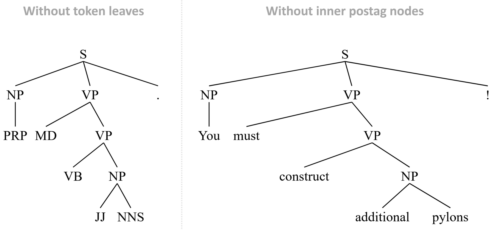

<div align="center">
  <p>
    <a href="#"></a>
  </p>
  <p align="center">
    <a href="https://pypi.org/project/constituent-treelib/"></a>
	<a href="https://opensource.org/licenses/MIT"></a>
  <a href="https://pypi.org/project/constituent-treelib"></a>
    <a href="https://github.com/Halvani/Constituent-Treelib/actions/workflows/python-package.yml"></a>
    <a href="https://github.com/Halvani/Constituent-Treelib"></a>
    <a href="https://doi.org/10.5281/zenodo.7765146"></a>
  </p>
</div>

# Constituent Treelib (CTL)
A lightweight Python library for constructing, processing, and visualizing constituent trees.

# Description
CTL is a lightweight Python library that offers you a convenient way to parse sentences into <a href="https://en.wikipedia.org/wiki/Constituent_(linguistics)">constituent trees</a>, modify them according to their structure, as well as visualize and export them into various [file formats](#Export_visualization). In addition, you can extract phrases according to their phrasal categories (which can be used e.g., as features for various NLP tasks), validate already parsed sentences in bracket notation or convert them back into sentences. 

CTL is built on top of <a href="https://github.com/nikitakit/self-attentive-parser">**benepar**</a> (*Berkeley Neural Parser*) as well as the two well-known NLP frameworks <a href="https://spacy.io">**spaCy**</a> and <a href="https://github.com/nltk/nltk">**NLTK**</a>. Here, spaCy is used for tokenization and sentence segmentation, while benepar performs the actual parsing of the sentences. NLTK, on the other hand, provides the fundamental data structure for storing and processing the parsed sentences. 

To gain a clearer picture of what a constituent tree looks like, we consider the following example. Let *S* denote the sentence...<br>
```
 "Isaac Asimov was an American writer and professor of biochemistry at Boston University."
 ```

 This sentence can be parsed into a bracketed tree string representation (shown below in a <a href="https://catalog.ldc.upenn.edu/LDC99T42">*Penn tree-bank*</a> style)   
```
(S
  (NP (NNP Isaac) (NNP Asimov))
  (VP
    (VBD was)
    (NP
      (NP (DT an) (JJ American) (NN writer) (CC and) (NN professor))
      (PP (IN of) (NP (NN biochemistry)))
      (PP (IN at) (NP (NNP Boston) (NNP University)))))
  (. .))
```

which represents the actual constituent tree. However, since this notation is not really easy to read, we can turn it into a nicer visualization using - guess what - CTL! Once we have parsed and visualized the tree, we can export it to a desired format, here for example as a <a href="https://github.com/Halvani/Constituent-Treelib/blob/main/assets/images/sample_tree.png">PNG</a> file:

<center>
<div>
  
</div>
<br>
</center>

In case you grew up in the <a href="https://en.wikipedia.org/wiki/Usenet">Usenet</a> era, you might prefer the classic ASCII-ART look...

```
                                          S                                                              
        __________________________________|____________________________________________________________   
       |                    VP                                                                         | 
       |           _________|____________________                                                      |  
       |          |                              NP                                                    | 
       |          |                  ____________|________________________________                     |  
       |          |                 |                       PP                    PP                   | 
       |          |                 |                    ___|_______          ____|_____               |  
       NP         |                 NP                  |           NP       |          NP             | 
   ____|____      |    _____________|____________       |           |        |     _____|______        |  
 NNP       NNP   VBD  DT    JJ      NN    CC     NN     IN          NN       IN  NNP          NNP      . 
  |         |     |   |     |       |     |      |      |           |        |    |            |       |  
Isaac     Asimov was  an American writer and professor  of     biochemistry  at Boston     University  . 
```
Regardless of which format is considered, the underlying representation[^1] shows three aspects of the structure of *S*:
- Linear order of the words and their part-of-speech: ``NNP = Isaac``, ``NNP = Asimov``, ``VBD = was``, ...
- Groupings of the words and their part-of-speech into phrases: ``NP = Isaac Asimov``, ``VP = an American writer and professor``, ``PP = of  biochemistry`` and ``PP = at Boston University``
- Hierarchical structure of the phrases: ``S``, ``VP``, ``NP`` and ``PP``


# Applications
Constituent trees offer a wide range of applications including:
- Analysis and comparison of sentence structures between different languages for (computational) linguists 
- Extracting phrasal features for certain NLP tasks (e.g., <a href="https://aclanthology.org/W19-5203">Machine Translation</a>, <a href="https://ieeexplore.ieee.org/document/6693511">Information Extraction</a>, <a href="https://aclanthology.org/2020.tacl-1.22">Paraphrasing</a>, <a href="https://github.com/andreasvc/authident">Stylometry</a>, <a href="https://aclanthology.org/P12-2034">Deception Detection</a> or <a href="https://dl.acm.org/doi/10.1145/2482513.2482522">Natural Language Watermarking</a>)
- Using the resulting representations as an input to train <a href="https://distill.pub/2021/gnn-intro/">GNNs</a> for specific tasks (e.g., <a href="https://doi.org/10.1093/database/baac070">Chemical–Drug Relation Extraction</a> or <a href="https://aclanthology.org/2020.emnlp-main.322">Semantic Role Labeling</a>)


# Features
- Easy construction of constituent trees from raw or already processed sentences
- Converting parsed constituent trees back into sentences
- Convenient export of tree visualizations into various [file formats](#Export_visualization)
- Extraction of phrases according to their <a href="https://dkpro.github.io/dkpro-core/releases/2.2.0/docs/tagset-reference.html">phrasal categories</a>
- Manipulation of the tree structure (without inner postag nodes or without token leaves)
- Multilingual (currently CTL supports [eight languages](#Available_models_and_languages))
- Automatic NLP pipeline creation (loads and installs the benepar + spaCy models on demand)
- No API dependency (after downloading the models CTL can be used completely offline)
- Extensively documented source code


# No Code Demo
In case you just want to play around with CTL, there is a minimally functional <a href="https://github.com/streamlit/streamlit">Streamlit</a> app that will be gradually extended. To run the demo, please first install Streamlit via: `pip install streamlit`. Afterwards, you can call the app from the command line as follows: `streamlit run ctl_app.py`


# Installation
The easiest way to install CTL is to use pip, where you can choose between (1) the PyPI[^2] repository and (2) this repository. 

- (1) ```pip install constituent-treelib```

- (2) ```pip install git+https://github.com/Halvani/constituent_treelib.git ```

The latter will pull and install the latest commit from this repository as well as the required Python dependencies. 

## Non-Python dependencies:
CTL also relies on two open-source tools to export constituent trees into various file formats:

- To export the constituent tree into a PDF, the command line tool **<a href="https://wkhtmltopdf.org/downloads.html">wkhtmltopdf</a>** is required. Once downloaded and installed, the path to the wkhtmltopdf binary must be passed to the export function. 
 
- To export the constituent tree into the file formats JPG, PNG, GIF, BMP, EPS, PSD, TIFF and YAML, the software suite **<a href="https://imagemagick.org/script/download.php#windows">ImageMagick</a>** is required.


# Quickstart
Below you can find several examples of the core functionality of CTL. More examples can be found in the <a href="https://github.com/Halvani/Constituent-Treelib/blob/main/Constituent_TreeLib_Quickstart.ipynb">jupyter notebook demo</a>. 


## Creating an NLP pipeline
To instantiate a ``ConstituentTree`` object, CTL requires a spaCy-based NLP pipeline that incorporates a benepar component. Although you can set up this pipeline yourself, it is recommended (and more convenient) to let CTL do it for you automatically via the ``create_pipeline()`` method. Given the desired [language](#Available_models_and_languages), this method creates the NLP pipeline and also downloads[^3] the corresponding spaCy and benepar models, if requested. The following code shows an example of this: 
```python
from constituent_treelib import ConstituentTree, BracketedTree, Language, Structure

# Define the language for the sentence as well as for the spaCy and benepar models
language = Language.English

# Define which specific SpaCy model should be used (default is Medium)
spacy_model_size = ConstituentTree.SpacyModelSize.Medium

# Create the pipeline (note, the required models will be downloaded and installed automatically)
nlp = ConstituentTree.create_pipeline(language, spacy_model_size)
 
>>> ✔ Download and installation successful
>>> You can now load the package via spacy.load('en_core_web_md')

>>> [nltk_data] Downloading package benepar_en3 to
>>> [nltk_data] [..] \nltk_data...
>>> [nltk_data] Unzipping models\benepar_en3.zip.
```

## Define a sentence
Next, we instantiate a ``ConstituentTree`` object and pass it the created NLP pipeline along with a sentence to parse, e.g. the memorable quote *"You must construct additional pylons!"*[^4]. Rather than a raw sentence, ``ConstituentTree`` also accepts an already parsed sentence wrapped as a BracketedTree object, or alternatively in the form of an NLTK tree. The following example illustrates all three options:  
```python
# Raw sentence
sentence = 'You must construct additional pylons!'

# Parsed sentence wrapped as a BracketedTree object
bracketed_tree_string = '(S (NP (PRP You)) (VP (MD must) (VP (VB construct) (NP (JJ additional) (NNS pylons)))) (. !))'
sentence = BracketedTree(bracketed_tree_string)

# Parsed sentence in the form of an NLTK tree
from nltk import Tree

sentence = Tree('S', [Tree('NP', [Tree('PRP', ['You'])]), Tree('VP', [Tree('MD', ['must']), Tree('VP', [Tree('VB', ['construct']), Tree('NP', [Tree('JJ', ['additional']), Tree('NNS', ['pylons'])])])]), Tree('.', ['!'])])

tree = ConstituentTree(sentence, nlp)
```

## Modified tree structure
CTL allows you to modify the structure of the tree by either:

- Eliminating **inner postag nodes** (tree contains now phrasal categories as inner nodes and tokens as leaves)

- Eliminating **token leaves** (tree contains now phrasal categories as inner nodes and postags as leaves)

```python
without_token_leaves = ConstituentTree(sentence, nlp, Structure.WithoutTokenLeaves)

without_inner_postag_nodes = ConstituentTree(sentence, nlp, Structure.WithoutPostagNodes)
```
The result...



Modified tree structures offer several benefits. One of them, for example, is saving space when using the visualizations in papers. Eliminating the inner postag nodes (shown on the right) reduces the tree height from level 5 to 4. Another useful application arises from the elimination of token leaves, which will be discussed in more detail in the following section.

## Extract phrases
Once we have created ``tree``, we can now extract phrases according to given <a href="https://dkpro.github.io/dkpro-core/releases/2.2.0/docs/tagset-reference.html">phrasal categories</a> e.g., verb phrases:  
```python
phrases = tree.extract_all_phrases()
print(phrases)

>>> {'S': ['You must construct additional pylons !'],
>>> 'VP': ['must construct additional pylons', 'construct additional pylons'],
>>> 'NP': ['additional pylons']}

# Only verb phrases..
print(phrases['VP'])

>>> ['must construct additional pylons', 'construct additional pylons']
```

As can be seen here, the second verb phrase is contained in the former. To avoid this, we can instruct the method to disregard nested phrases:  
```python
non_nested_phrases = tree.extract_all_phrases(avoid_nested_phrases=True)
print(non_nested_phrases['VP'])

>>> ['must construct additional pylons']
```
If you want to extract phrases, but are more interested in their postag representation than the actual words/tokens, you can apply the same function to the modified tree...
```python
pos_phrases = without_token_leaves.extract_all_phrases()
print(pos_phrases)

>>> {'S': ['PRP MD VB JJ NNS .'],
>>> 'NP': ['JJ NNS'],
>>> 'VP': ['MD VB JJ NNS', 'VB JJ NNS']}
```
This is especially helpful when investigating the writing style of authors.


<a name="Export_visualization"></a>
## Export the tree
CTL offers you to export a constituent tree into various file formats, which are listed below. Most of these formats result in a visualization of the tree, while the remaining file formats are used for data exchange. 

| Extension | Description | Output |
| --- | --- | --- |
| **PDF** | *Portable Document Format* | Vector graphic|
| **SVG** | *Scalable Vector Graphics* | Vector graphic|
| **EPS** | *Encapsulated PostScript* | Vector graphic|
| **JPG** | *Joint Photographic Experts Group* | Raster image|
| **PNG** | *Portable Network Graphics* | Raster image|
| **GIF** | *Graphics Interchange Format* | Raster image|
| **BMP** | *Bitmap* | Raster image|
| **PSD** | *Photoshop Document* | Raster image|
| **TIFF** | *Tagged Image File Format* | Raster image|
| **JSON** | *JavaScript Object Notation* | Data exchange format |
| **YAML** | *Yet Another Markup Language* | Data exchange format |
| **TXT** | *Plain-Text* | Pretty-print text visualization|
| **TEX** | *LaTeX-Document* | LaTeX-typesetting |

The following example shows an export of the tree into a PDF file:

```python
tree.export_tree(destination_filepath='my_tree.pdf', verbose=True)

>>> PDF - file successfully saved to: my_tree.pdf
```

In the case of raster/vector images, CTL automatically removes unnecessary margins with respect to the resulting visualizations. This is particularly useful if the visualizations are to be used in papers. 
 

<a name="Available_models_and_languages"></a>
## Available models and languages
CTL currently supports eight languages: English, German, French, Polish, Hungarian, Swedish, Chinese and Korean. The performance of the respective models can be looked up in the <a href="https://github.com/nikitakit/self-attentive-parser#available-models">benepar repository</a>. 


# License
The code and the <a href="https://github.com/Halvani/Constituent-Treelib/blob/main/Constituent_TreeLib_Quickstart.ipynb">jupyter notebook demo</a> of CTL are released under the MIT License. See <a href="https://github.com/Halvani/constituent_treelib/blob/main/LICENSE">LICENSE</a> for further details.


# Citation
If you find this repository helpful, feel free to cite it in your paper or project: 
```bibtex
@software{Halvani_Constituent_Treelib:2024,
	author = {Halvani, Oren},
	title = {{Constituent Treelib - A Lightweight Python Library for Constructing, Processing, and Visualizing Constituent Trees.}},
	doi = {10.5281/zenodo.10951644},
	month = apr,	
	url = {https://github.com/Halvani/constituent-treelib},
	version = {0.0.7},
	year = {2024}
}
```
Please also give credit to the authors of benepar and <a href="https://github.com/nikitakit/self-attentive-parser#citation">cite their work</a>.


[^1]: Note, if you are not familiar with the bracket labels of constituent trees, have a look at the following <a href="https://gist.github.com/nlothian/9240750">Gist</a> 
or alternatively <a href="http://surdeanu.cs.arizona.edu/mihai/teaching/ista555-fall13/readings/PennTreebankConstituents.html">this website</a>. 

[^2]: It's recommended to install CTL from <a href="https://pypi.org">PyPI</a> (*Python Package Index*). However, if you want to benefit from the latest update of CTL, you should use this repository instead, since I will only update PyPi at irregular intervals. 

[^3]: After the models have been downloaded, they are cached so that there are no redundant downloads when the method is called again. However, loading and initializing the spaCy and benepar models can take a while, so it makes sense to invoke the ``create_pipeline()`` method only once if you want to process multiple sentences.

[^4]: https://knowyourmeme.com/memes/you-must-construct-additional-pylons